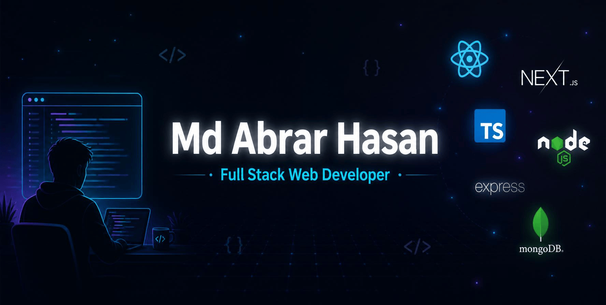

<!--- banner --->

 

<!--- title --->

  <ul align="center">
    
<h1 style="display: inline-block">Hi 👋, I'm Md Abrar Hasan</h1>

    <!--- typing animation --->
    
  </ul>

 

<!--- about me --->
## <b> ABOUT ME:</b>

I'm **Md Abrar Hasan**, a passionate Full Stack Web Developer from Khulna, Bangladesh. I specialize in building scalable, high-performance web applications using the MERN stack and modern frontend technologies. I love turning ideas into clean, user-friendly interfaces and writing robust backend logic that powers real-world products. Driven by curiosity, I'm always exploring new tools, contributing to open-source, and pushing myself to write better code every day.

 

<!--- current activities --->
## <b> CURRENT ACTIVITIES:</b>

- 🔭 I'm currently exploring **Next.js App Router** and **Server Components**.
- 💻 I'm working on a **tourism and booking website** project.
- 🌱 I'm learning and practicing **TypeScript** and **Tailwind CSS** at an advanced level.
- 🤝 I'm trying to contribute more to **open-source projects**.
- 🎯 I'm focused on building **production-ready, scalable web applications**.
 

<!--- socials --->
## <b> CONNECT WITH ME:</b>

  

    
    
  

 

<!--- technology stack --->
## <b> TECHNOLOGY STACK:</b>

### Languages:

### Frontend Frameworks & Libraries:

### Backend & Runtime:

### Database:

### Tools & Platforms:

 

<!--- statistics --->
## <b> GITHUB STATISTICS:</b>

### GitHub Stats & Top Languages:
|  |  |
| ------------- | ------------- |

### Streak & Trophies:
|  |  |
| ------------- | ------------- |

### Contribution Graph:
<picture>
  <source media="(prefers-color-scheme: dark)" srcset="https://raw.githubusercontent.com/abrar12678/abrar12678/gh-pages/github-contribution-graph-snake-dark.svg">
  <source media="(prefers-color-scheme: light)" srcset="https://raw.githubusercontent.com/abrar12678/abrar12678/gh-pages/github-contribution-graph-snake.svg">
  
</picture>

 

<!--- random quote --->
## <b> RANDOM DEV QUOTE:</b>

---

<!--- visit count --->

  

